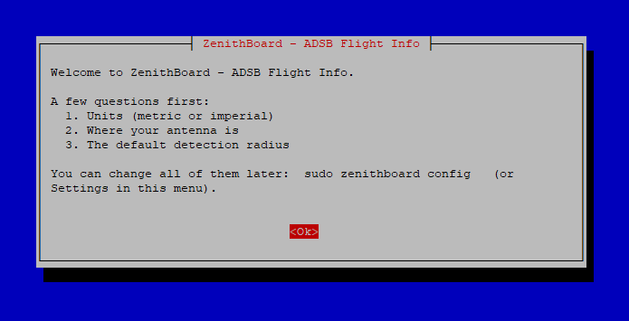
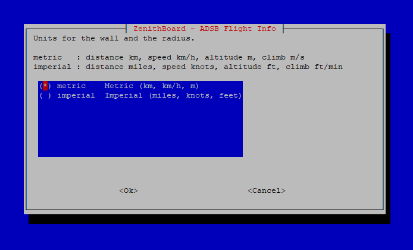
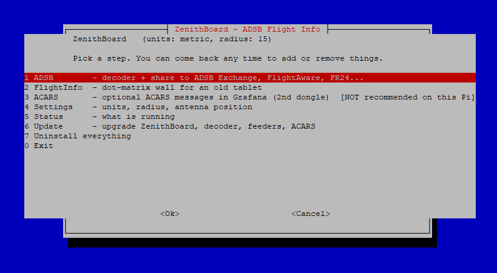

# ZenithBoard — ADSB Flight Info

**See the planes flying right above your house, on an old tablet, in glowing dot-matrix lights — and share the same antenna with the big flight-tracking networks.**

ZenithBoard turns a Raspberry Pi (4 or newer recommended) and a cheap USB radio dongle into:

1. **An ADS-B receiver** that feeds **ADSB Exchange** (mandatory base layer) and, if you want, **FlightAware**, **Flightradar24** and **Plane Finder** — with **one single MLAT client**, because several at once overload a Raspberry Pi.
2. **FlightInfo**, a responsive **dot-matrix wall** for any tablet or screen with a browser. It automatically cycles through every aircraft inside the radius you choose (1, 2, 5, 10, 15, 30 or 50 km / miles) — callsign, type, altitude, speed, where the flight comes from and goes to, distance and direction — and refreshes itself.
3. **ACARS** *(optional)*: aircraft text messages collected with a second dongle and shown in **Grafana**, filtered, and automatically rolled and cleaned every 7 days.

Everything is installed from one menu, and you can come back at any time to add or remove parts.

> **Status: v0.1 (early).** The wall, the configuration tools and the tests work and are verified on a PC. The installer scripts have **not yet been run on real Raspberry Pi hardware** — please try it and open an issue with anything that breaks. See [Known limits](#known-limits).

Inspired by [jprochazka/adsb-receiver](https://github.com/jprochazka/adsb-receiver). ZenithBoard is an independent project with a smaller scope, not a fork.

---

## What you need

| Item | Notes |
|---|---|
| Raspberry Pi **4 or newer** | 2 GB+ recommended (1 GB is enough without ACARS). Raspberry Pi OS **Lite** (Bookworm or newer). See [Which Raspberry Pi?](#which-raspberry-pi) |
| Micro-SD card 16 GB+ | |
| **RTL-SDR dongle** + **1090 MHz antenna** | A dongle with a built-in 1090 filter (e.g. "ADS-B" or "FlightAware Pro Stick") gives the best range. |
| *(optional)* a **second** RTL-SDR dongle + 131 MHz antenna | Only for ACARS. The ADS-B dongle cannot do both. See [docs/HARDWARE.md](docs/HARDWARE.md). |
| An old tablet or any screen | Anything with a modern browser on your home Wi-Fi. |
| Accounts | A free [ADSB Exchange](https://www.adsbexchange.com/myip/) key is asked during setup. FlightAware / Flightradar24 / Plane Finder accounts only if you choose them. |

### Which Raspberry Pi?

Estimates, not yet measured on real boards.

| Board | ADS-B + feeders + wall | + ACARS & Grafana |
|---|---|---|
| **Pi 5 / Pi 4, 2 GB or more** | Comfortable | Comfortable (Pi 4 with 2 GB: fine) |
| **Pi 4, 1 GB** | Good (about 400–550 MB used). Keep to one or two extra feeders. | Not recommended: about 900 MB more needed |
| **Pi 3B / 3B+ (1 GB)** | Works. Prefer Ethernet and a good power supply. | Not recommended (Grafana is slow, `acarsdec` takes long to build) |
| Pi Zero 2 W / Pi 2 | ADS-B and the wall only, no extra feeders | No |

The installer detects the board and its memory, warns you once, and marks ACARS as *not recommended* in the menu on low-memory or older boards (you can still continue). `zenithboard status` shows the free memory.

---

## Install — step by step

### 1. Prepare the SD card
1. Install **Raspberry Pi Imager** from <https://www.raspberrypi.com/software/>.
2. Choose *Raspberry Pi 4*, then **Raspberry Pi OS Lite (64-bit)** (under "Raspberry Pi OS (other)"), then your SD card.
3. Click **Edit settings** and fill in: hostname (e.g. `zenithboard`), your username + password, your Wi-Fi (skip if you use Ethernet), time zone, and **enable SSH**.
4. Write the card, put it in the Pi, plug in the dongle (a USB 2.0 port is best) and power on. Wait 2–3 minutes.

### 2. Connect to the Pi
From your computer's terminal (Windows 10/11, macOS and Linux all have one):

```bash
ssh YOUR_USERNAME@zenithboard.local
```

If the name is not found, use the Pi's IP address from your router instead.

### 3. Download and run ZenithBoard
```bash
sudo apt update && sudo apt install -y git
git clone https://github.com/regis57/ZenithBoard.git
cd ZenithBoard
sudo ./install.sh
```

### 4. Answer the first questions
The first run asks, once:

* **Units** — *metric* (km, km/h, metres, m/s) or *imperial* (miles, knots, feet, ft/min).
* **Antenna position** — latitude, longitude, altitude (needed by the decoder, MLAT and the wall's distance calculation). Tip: right-click your house in Google Maps to copy the coordinates.
* **Default radius** — how close a plane must be to appear on the wall.

<p align="center"></p>
<p align="center"></p>

### 5. Use the menu
After the questions, the installer shows its main menu. You can come back to it at any time with `sudo ./install.sh` (or `sudo zenithboard menu`) to add or remove things.

<p align="center"></p>

**1 · ADSB** — pick the decoder (**readsb** is recommended; **dump1090-fa** is supported as an alternative; both feed the same local port so every feeder works with either). Then tick where to share. *ADSB Exchange is always on.* The ADSB Exchange script will ask for a station name and your position, and prints a link to see your feed. FlightAware prints a claim link; **Flightradar24** runs FR24's own sign-up after printing what to answer (paste your *sharing key* — flightradar24.com → account → *My data sharing* — if you already feed FR24; otherwise Enter); Beast, `127.0.0.1`, port `30005` and MLAT no are enforced afterwards; Plane Finder finishes setup on a small web page. Unticking an installed feeder removes it after a confirmation.

**2 · FlightInfo** — installs the wall. At the end it prints the address, e.g. `http://192.168.1.50:8080/`.

**3 · ACARS** *(optional)* — asks for the second dongle's serial number and your frequencies, builds `acarsdec`, installs Grafana and a ready-made dashboard at `http://<pi-address>:3000/` (first login `admin` / `admin`, you are asked to change it).

### 6. Put the wall on the tablet
Open the address from step 2 in the tablet's browser. Tap the browser's *Add to Home Screen* for a full-screen app look, or tap the faint gear in the top-right corner → **Full screen**. The screen stays awake and the page reloads itself if the Pi restarts.

Check that everything is healthy at any time:

```bash
zenithboard status
```

---

## Changing units, radius and position later

Three ways, pick the one that suits you.

| Where | How |
|---|---|
| **Command line** (affects every screen) | `sudo zenithboard units imperial` · `sudo zenithboard units metric` · `sudo zenithboard radius 5` · `sudo zenithboard cycle 8` |
| **Menu** | `sudo zenithboard menu` → *4 Settings* |
| **On the tablet** (that tablet only) | Tap the faint gear in the top-right corner: units, radius, seconds per plane, colour (amber / green / red / white). Or use a link: `http://<pi>:8080/?units=imperial&radius=5&theme=green` |

Radius presets are **1, 2, 5, 10, 15, 30, 50** — read as kilometres in metric mode and miles in imperial mode. Changes apply immediately, no restart or reinstall.

### Moving the antenna (position)

```bash
sudo zenithboard location 49.1193 6.1757 180      # latitude, longitude, altitude in metres
```

(or menu *4 Settings → Antenna position*). The position is updated **everywhere ZenithBoard can reach**: the wall, readsb / dump1090-fa, ADSB Exchange (including its MLAT) and Plane Finder. A summary then lists anything only the provider's website can change (FlightAware and Flightradar24 hold your position in your online account) with the page to open.

All settings live in one readable file: `/etc/zenithboard/config.env`.

> **Note — position and altitude per feeder**
>
> * **Altitude** is the height of the *antenna above sea level*: ground elevation at your house **plus** the antenna's height above the ground. `zenithboard location` takes it in **metres**.
> * **Precision:** 4 decimals (about 10 m) is plenty, e.g. `49.1193 6.1757`.
> * Updated automatically by `zenithboard location`: ZenithBoard, readsb / dump1090-fa, ADSB Exchange (feeder and MLAT), Plane Finder when its config file is found.
> * **Flightradar24 — by hand:** [flightradar24.com](https://www.flightradar24.com) → your account → *My data sharing* → your receiver → edit latitude, longitude and altitude. FR24 wants the altitude in **feet** (metres × 3.281; 180 m ≈ 591 ft). The position is stored in your FR24 account, not on the Pi.
> * **FlightAware — by hand** (only if PiAware is installed): [flightaware.com/adsb/stats](https://flightaware.com/adsb/stats) → *My ADS-B* → your site → edit the location. Check the unit shown next to the altitude field before typing.
> * **Plane Finder — by hand** if the command could not do it: open `http://<pi-address>:30053` and change the position there (check the unit shown).
> * A wrong position on a provider's site does not break anything: aircraft are simply plotted slightly off there, and MLAT (ADSB Exchange only) is less accurate. Your own wall is not affected.

---

## What the wall shows

```
+--------------------------------------+---------------+
| ZZA210                               |   aircraft    |
| ZENITH AIR                           |   silhouette  |
| A320 F-ZZAA                          |   (dots)      |
| ALT  10670 M                         +---------------+
| SPD  833 KMH                         |  REAL PHOTO   |
| LUXEMBOURG                           |  of the plane |
| →PARIS                               |  - or, with   |
|                                      |  no photo, an |
| 6/7 3.6KM NNE                        |  animated sky |
+--------------------------------------+---------------+
```

* **Left (dots):** callsign, airline name, aircraft type and registration, altitude and speed. Then **where the flight comes from** and, after an arrow, **where it is going**: the airport's name when it fits, otherwise its city (`LUXEMBOURG`, `→PARIS`). See [Flight routes](#flight-routes). The last line gives the *position in the cycle*, the distance and the direction **from you** (`NNE`).
* **Top right (dots):** a **silhouette that matches the real aircraft design**: an A380 is drawn as a four-engine airliner, a Cessna as a single-engine propeller plane, an F-16 as a fighter. See [Aircraft silhouettes](#aircraft-silhouettes).
* **Bottom right (a real picture, not dots):** the **photo of that exact aircraft** from [Planespotters](https://www.planespotters.net/), with the photographer's name and a link to the photo page. When there is no photo (or no internet) it shows an **animated sky** with a **side view of the matching aircraft model**, labelled with the model name. The sky follows your clock as one continuous day: the sun rises along its arc and sets, the colours slide from dawn through midday to dusk, the clouds are lit from the side the sun is on, thin cirrus drifts overhead, and at night the stars twinkle under a crescent moon. Propellers and rotors turn.
* Aircraft are shown nearest first, one at a time, for a few seconds each, with a wipe transition. With nothing in range the wall shows a clock and how many aircraft your antenna sees.

## Colours

The dots are **amber by default**. Pick amber, green, red or white:

| Where | How |
|---|---|
| **Every screen** | `sudo zenithboard color green` (back to the default: `sudo zenithboard color amber`) |
| **Menu** | `sudo zenithboard menu` → *4 Settings → Colour* |
| **One tablet only** | Tap the faint gear in the top-right corner → *Colour*. Or open `http://<pi>:8080/?theme=red`. The gear's **Reset** returns that tablet to the Pi's colour. |

## Aircraft silhouettes

ZenithBoard has **no airline logos** (they are trademarks). It draws the **shape of the aircraft** instead, from original geometric drawings. There are 15 kinds, and some have variants:

| Silhouette | Examples |
|---|---|
| Single-aisle airliner | A320 family, 737, 757, A220, E-Jets, C919 |
| Wide-body twin | 777, 787, A330, A350, 767 (three-engine DC-10 / MD-11 and the Beluga have their own variants) |
| Four-engine airliner | 747 (with its hump), A380 (double deck), A340, 707, DC-8, BAe 146 |
| Rear-engined T-tail jet | CRJ, ERJ-145, MD-80, DC-9, 727, Fokker 100, Tu-154 |
| Turboprop | ATR 42/72, Dash 8, Saab 340, Do 328, King Air |
| Business jet | Citation, Learjet, Gulfstream, Falcon, Phenom, HondaJet |
| Light aircraft / twin piston | Cessna 172, Cirrus, Piper, Pilatus PC-12, TBM / Seneca, Baron |
| Helicopter | Single rotor, Chinook (two rotors), V-22 (tilt-rotor), gyrocopters |
| Fighter / delta-wing | F-16, F-15, F-18, F-35, MiG, Su-27 / Eurofighter, Rafale, Mirage, Gripen |
| Military transport / bomber | C-130, C-17, A400M, Il-76, An-124 / B-52, B-1, Tu-95 |
| Glider, balloon | |

Military aircraft are drawn in grey and labelled `MILITARY` when they have no airline.

**How the type is found:** every aircraft broadcasts its ICAO type code (`A388`, `C172`, `F16`...). ZenithBoard has a built-in table of those codes covering airliners, business and light aircraft, helicopters and military types. For a code it does not know, it uses the aircraft's ADS-B category, and, if you have the data refresh below, the engine description from the downloaded list.

### Aircraft model list: monthly refresh (optional)

To show full model names and to recognise newly registered type codes, ZenithBoard can download a free list of about 2,800 aircraft types from the [tar1090-db](https://github.com/wiedehopf/tar1090-db) project (itself derived from the Mictronics aircraft database). The list is downloaded **to your Pi only** and is never part of this repository.

* **On by default** when FlightInfo is installed: downloaded once at install, then refreshed **once a month** (it also catches up after the Pi was switched off).
* Turn it off or on: **`sudo zenithboard data auto off`** / **`on`**, or the menu *4 Settings → Monthly aircraft-data refresh*.
* Refresh now: `sudo zenithboard data update`. Check: `zenithboard data status`.
* A failed download (no internet, broken file) changes nothing: the previous list stays in use, and the wall works without the list at all.

## Flight routes

ADS-B only carries the aircraft's identity, position, altitude and speed: **it never says where the flight comes from or goes to.** ZenithBoard therefore looks the route up from the callsign (for example `DLH4YK`) on [adsbdb.com](https://www.adsbdb.com/), a free community database, and shows the airport's name when it fits in the 14 characters of the text column, otherwise the city. Accents are removed because the dot font has none (`ZÜRICH` → `ZURICH`).

* **No route is shown** for aircraft whose callsign is not an airline callsign (private planes, helicopters, military) or that are not in the database: the two rows stay empty.
* **It is an indication, not a guarantee.** A callsign can be reused for another route, and the database is maintained by volunteers.
* **Privacy:** only the callsign of an aircraft in your radius is sent to adsbdb.com, never your position. Requests are spaced out (one every 1.5 s) and answers are kept for 12 hours. Turn it off if you prefer nothing to leave the Pi: `sudo zenithboard routes off` (or menu *4 Settings → Flight origin/destination*).
* Needs internet on the Pi; the wall works without it. If a lookup fails (network hiccup) it is retried after one minute.
* **Route missing on a flight you know?** Run `zenithboard routes test TRA913C` (use your callsign): it asks adsbdb from your Pi and prints what it knows, or why it could not. `zenithboard logs flightinfo` lists failed lookups.

## Photos

Photos come from the [Planespotters.net photo API](https://www.planespotters.net/photo/api), looked up by the aircraft's hex address. They belong to their photographers: the wall shows each photo unmodified, with the photographer's name and a link to the page on Planespotters, and keeps nothing on disk (a small memory cache only). The Pi fetches the photos, so **the tablet does not need internet**. Please read Planespotters' API terms for your own use.

* Turn photos off or on: `sudo zenithboard photos off` / `on` (or menu *4 Settings → Aircraft photos*). With photos off, the animated sky scene is shown for every aircraft.
* Not every aircraft has a photo; those show the animated scene.
* Planespotters limits how fast it can be asked and answers `403 Forbidden` to bursts, so the wall queues its lookups and makes **at most one request every 2 seconds**. With a busy sky the first aircraft of a cycle may show the animated scene and get its photo on the next pass. A refused lookup is retried ten minutes later, never remembered as "no photo".
* Check that your Pi can really reach the service, without waiting for an aircraft: `zenithboard photos test`. It asks Planespotters about a few well-photographed airliners and downloads one image. Add a hex address to test one aircraft: `zenithboard photos test 3c6444`.
* `zenithboard status` shows whether photos are on.

### Try it without any hardware
The demo uses invented airlines and an example of everything: an airliner, a business jet, an A380, a 747, a turboprop, a Cessna, a helicopter, an F-16, a C-130, plus mock "photos" (cartoon illustrations of the right aircraft model, marked *DEMO*) and invented routes. Some demo aircraft have a mock photo or a route and some deliberately do not, so you can see every state: photo or animated sky, route or empty rows. Run it from the ZenithBoard folder on any computer or Pi with Python 3:

```bash
./bin/zenithboard-demo                  # metric, amber
./bin/zenithboard-demo imperial green   # units, then colour
REAL_PHOTOS=1 ./bin/zenithboard-demo    # also fetch the real photos and routes of the demo's two real airliners
```

Then open **`http://<the-pi-address>:8081/`** (or `http://localhost:8081/` on the same computer).

> **Do not run the demo on port 8080.** The real wall already uses 8080 once FlightInfo is installed, and a second program on the same port fails with `Address already in use`. The demo therefore defaults to **8081**. If 8081 is also taken: `PORT=8082 ./bin/zenithboard-demo`.

---

## Network ports (what answers where)

| Address | What | Notes |
|---|---|---|
| `http://<pi>:8080/` | **ZenithBoard wall** | Change with `sudo zenithboard config-set PORT 8090` |
| `http://<pi>:8081/` | ZenithBoard **demo** | Only while `zenithboard-demo` runs |
| `http://<pi>/tar1090/` | **Map of your own receiver** | Served on **port 80**, so it never clashes with 8080. Installed with readsb. If you also ran the ADSB Exchange web interface installer, that one is at `http://<pi>/adsbx/`. `zenithboard status` prints whichever you have. |
| <https://www.adsbexchange.com/myip/> | ADSB Exchange feed status | Open it from the same network as the Pi: it tells you whether your feed is received |
| `http://<pi>:3000/` | Grafana (ACARS) | Only if ACARS is installed |
| `http://<pi>:30053/` | Plane Finder setup page | Only if Plane Finder is installed |

`zenithboard status` prints the ones that apply to your Pi.

---

## How it fits together

```
1090 MHz dongle
      |
      v
readsb (or dump1090-fa) --- aircraft.json ---> FlightInfo server ---> tablet (dot-matrix wall)
      |
      +-- Beast TCP 127.0.0.1:30005 --+--> ADSB Exchange   (+ the ONE mlat client)
                                      +--> FlightAware     (MLAT off)
                                      +--> Flightradar24   (MLAT off)
                                      +--> Plane Finder

131 MHz dongle --> acarsdec --> UDP JSON --> ingester (filter, 7-day rolling) --> SQLite --> Grafana
```

**Single MLAT:** ADSB Exchange owns the only MLAT client. The installer switches MLAT off in PiAware and Flightradar24, and `zenithboard status` counts running MLAT processes so you can verify it is exactly one.

**ACARS retention:** the ingester drops acknowledgements, link tests and empty messages (configurable in `config.env`) and deletes everything older than `ACARS_RETENTION_DAYS` (default 7) every hour.

---

## Updating and uninstalling

**One command updates everything** (ZenithBoard itself from GitHub, readsb / dump1090-fa, ADSB Exchange, FlightAware, Flightradar24, Plane Finder, acarsdec, Grafana). Your settings are kept:

```bash
sudo zenithboard update
```

**Which version do I have?** `zenithboard version` (also shown at the top of the menu and in `zenithboard status`). After an update it should show the newest version listed in the [changelog](CHANGELOG.md); if the update could not fetch the code it prints `NOT updated: staying on version ...`.

If a Pi still runs an older ZenithBoard whose update fails with *Diverging branches* (the project's history was rewritten), do this once, then update normally:

```bash
sudo chown -R "$USER":"$USER" ~/ZenithBoard      # earlier updates ran git as root: give the folder back to you
cd ~/ZenithBoard && git fetch origin && git reset --hard origin/main && sudo ./install.sh --deploy
sudo zenithboard update
```

The same is available in the menu (*6 Update*). Run it whenever a provider releases a new version, or once a month. If a provider changes a download link, edit it in [`lib/versions.sh`](lib/versions.sh) and run the update again.

```bash
sudo zenithboard menu                                 # add or remove any component at any time
sudo /opt/zenithboard/install.sh --uninstall-all      # remove everything
```

---

## Troubleshooting

| Symptom | Try |
|---|---|
| Wall says **NO DATA – RECEIVER NOT RESPONDING** | `zenithboard status` — is the decoder running? `zenithboard logs decoder`. Dongle plugged in and not shared with ACARS? |
| Wall says NO FLIGHTS for a long time | Raise the radius (`sudo zenithboard radius 30`). Check `zenithboard status` for the aircraft count. |
| Wall opens but looks cropped | Use the gear → **Full screen**, or *Add to Home Screen*. |
| Two MLAT clients in `status` | `sudo zenithboard mlat-guard` |
| ACARS panels empty | `zenithboard logs acars`; confirm the ACARS dongle serial in `zenithboard config` and that frequencies are correct for your region. |
| `apt update` says the **Flightradar24 repository "is not signed"** (`SHA1 is not considered secure`) | Debian 13 (trixie) rejects the SHA1 signature of FR24's first key. `sudo zenithboard update` installs FR24's 2026 key, **only if its fingerprint is `ED84 3290 A602 4136 85E5 7D43 6F77 03F6 5FA1 BDAF`**, and never turns signature checking off. Then add Flightradar24 again from menu *1 ADSB*. |
| Grafana asks for a login | Default `admin` / `admin`. Menu 3 can allow anonymous *viewing* on your LAN only. |

---

## Known limits

* **Not yet validated on a real Raspberry Pi** — third-party installers (readsb, ADSB Exchange, Flightradar24, Plane Finder, `acarsdec`) change over time. Version pins and URLs are all in [`lib/versions.sh`](lib/versions.sh).
* Feeder download addresses (FlightAware, Plane Finder, ...) are pinned in [`lib/versions.sh`](lib/versions.sh) and were copied from each provider's own page on 6 October 2026. Providers do rename and move files from time to time; if an install stops with a 404, that file is the one to update (and a pull request or issue is welcome).
* FlightAware and Flightradar24 store your antenna position on their websites: after `zenithboard location`, update it there too (the command tells you where).
* ACARS legality differs per country — check your local rules before collecting ACARS messages.
* Photos come from Planespotters and need internet on the Pi. The live photo lookup has not yet been checked against the real service on a Raspberry Pi; the demo and the tests exercise the same code with stand-ins. Run `zenithboard photos test` on your own Pi to confirm it works there.
* Routes come from adsbdb.com by callsign. The answer format is checked against the real service and covered by tests, but the live lookup has not yet been run on a Raspberry Pi: `REAL_PHOTOS=1 ./bin/zenithboard-demo` shows the real route of the demo's two airliners.
* The airline name list is built in (about 90 major airlines); other airlines show the callsign only.

## Contributing & tests

```bash
python3 -m unittest discover -s tests -v     # server + ACARS
node tests/test_format.js                    # wall formatting / units
node tests/test_shapes.js                    # silhouettes seen from above
node tests/test_scene.js                     # side views / animated scene
node tools/make_demo_photos.js               # rebuild the demo's mock photos
shellcheck -x install.sh bin/* lib/*.sh      # installer
```

## License

ZenithBoard is free software under the **GNU General Public License v3.0 or later** — see [LICENSE](LICENSE).
