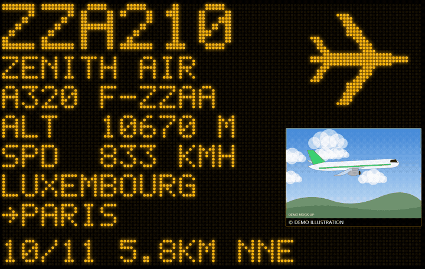
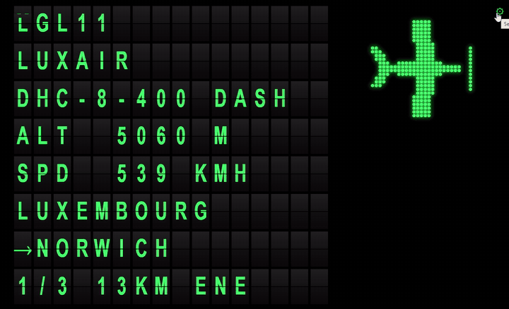
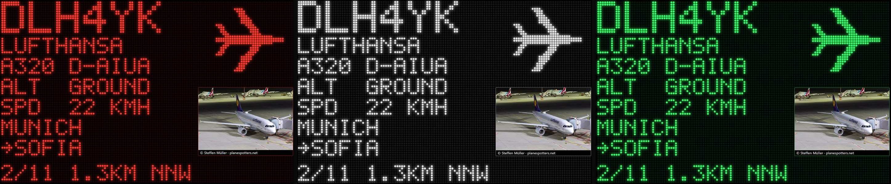

# ZenithBoard — ADSB Flight Info

[](LICENSE)
[](https://github.com/regis57/ZenithBoard/actions/workflows/ci.yml)
[](https://buymeacoffee.com/regis57)

**See the planes flying right above your house, on an old tablet, in glowing dot-matrix lights — and share the same antenna with the big flight-tracking networks.**

ZenithBoard turns a Raspberry Pi (4 or newer recommended) and a cheap USB radio dongle into:

1. **An ADS-B receiver** that feeds **ADSB Exchange** (mandatory base layer) and, if you want, **FlightAware**, **Flightradar24** and **Plane Finder** — with **one single MLAT client**, because several at once overload a Raspberry Pi.
2. **FlightInfo**, a responsive **flight wall** for any tablet or screen with a browser, in **dot matrix** or in the style of an **old airport split-flap board**. It automatically cycles through every aircraft inside the radius you choose (1, 2, 5, 10, 15, 30 or 50 km / miles) — callsign, type, altitude, speed, where the flight comes from and goes to, distance and direction — and refreshes itself.
3. **ACARS** *(optional)*: aircraft text messages collected with a second dongle and shown in **Grafana**, filtered, and automatically rolled and cleaned every 7 days.

Everything is installed from one menu, and you can come back at any time to add or remove parts.

> **Status:** running every day on the author's Raspberry Pi (Raspberry Pi OS, Debian 13) with readsb, ADSB Exchange and Flightradar24. Parts that could not be tried on real hardware yet (978 MHz UAT for the US, ACARS) are marked as such. Please open an issue with anything that breaks. The full picture of what is proven and what is not is in the wiki: **[Project status](https://github.com/regis57/ZenithBoard/wiki/Project-status)**.

Inspired by [jprochazka/adsb-receiver](https://github.com/jprochazka/adsb-receiver). ZenithBoard is an independent project with a smaller scope, not a fork.

---

## See it

**Watch:** [the 38-second Short](https://youtube.com/shorts/bhOSN4SAK3U) · [the split-flap Short](https://youtube.com/shorts/RpelTSHk6jo) · [the short how-to (no installation details)](https://youtu.be/vuBje80VaZA) · [the whole playlist](https://www.youtube.com/channel/UCBlFORfQZ6XtUnpuG5fBd9Q/playlists)

<p align="center">&nbsp;</p>

<p align="center"></p>

The story behind the project: [ZenithBoard on regis-hennequin.info](https://regis-hennequin.info/beyond-the-desk/adsb/zenithboard/).

---

## Contents

| | |
|---|---|
| **1. Get started** | [What you need](#what-you-need) · [Install, step by step](#install--step-by-step) |
| **2. Network** | [Wi-Fi](#wi-fi) · [Fixed IP](#fixed-ip-address) · [A name for your wall](#a-name-for-your-wall) · [Ports](#network-ports-what-answers-where) |
| **3. The wall** | [What it shows](#what-the-wall-shows) · [Look](#look-dot-matrix-or-airport-split-flap-board) · [Colours](#colours) · [Units, radius, position](#units-radius-and-position) · [Silhouettes](#aircraft-silhouettes) · [Routes and models](#flight-routes) · [Photos](#photos) · [Demo](#try-it-without-any-hardware) |
| **4. The receiver** | [Gain](#gain-tune-the-dongle-optional) · [978 MHz UAT (US)](#978-mhz-uat-united-states) |
| **5. Keep it running** | [Update](#updating-and-uninstalling) · [Logs](#logs-size-review-clean-optional) · [Reliability](#reliability-when-the-pi-freezes-or-loses-its-network-optional) · [Troubleshooting](#troubleshooting) · [Known limits](#known-limits) |
| **The wiki** | [Roadmap](https://github.com/regis57/ZenithBoard/wiki/Roadmap) · [Project status](https://github.com/regis57/ZenithBoard/wiki/Project-status) · [Architecture](https://github.com/regis57/ZenithBoard/wiki/Architecture) · [Settings](https://github.com/regis57/ZenithBoard/wiki/Configuration-reference) · [Commands](https://github.com/regis57/ZenithBoard/wiki/Command-reference) · [Testing](https://github.com/regis57/ZenithBoard/wiki/Testing) |

**Which defaults does what?** Everything in menu *4 Settings* (and `zenithboard ...`) sets the **default for every screen**. The gear icon on a tablet, or a link such as `?mode=flap`, only overrides it **for that tablet**; the gear's *Reset* returns the tablet to the Pi's default. So the two do not duplicate each other: one is the house rule, the other a personal choice.

---

# 1. Get started

## What you need

| Item | Notes |
|---|---|
| Raspberry Pi **4 or newer** | 2 GB+ recommended (1 GB is enough without ACARS). Raspberry Pi OS **Lite** (Bookworm or newer). See [Which Raspberry Pi?](#which-raspberry-pi) |
| Micro-SD card 16 GB+ | |
| **RTL-SDR dongle** + **1090 MHz antenna** | A dongle with a built-in 1090 filter (e.g. "ADS-B" or "FlightAware Pro Stick") gives the best range. |
| *(optional)* a **second** RTL-SDR dongle + 131 MHz antenna | Only for ACARS. The ADS-B dongle cannot do both. See [docs/HARDWARE.md](docs/HARDWARE.md). |
| An old tablet or any screen | Anything with a modern browser on your home Wi-Fi. |
| Accounts | A free [ADSB Exchange](https://www.adsbexchange.com/myip/) key is asked during setup. FlightAware / Flightradar24 / Plane Finder accounts only if you choose them. |

### Which Raspberry Pi?

Estimates, not yet measured on real boards.

| Board | ADS-B + feeders + wall | + ACARS & Grafana |
|---|---|---|
| **Pi 5 / Pi 4, 2 GB or more** | Comfortable | Comfortable (Pi 4 with 2 GB: fine) |
| **Pi 4, 1 GB** | Good (about 400–550 MB used). Keep to one or two extra feeders. | Not recommended: about 900 MB more needed |
| **Pi 3B / 3B+ (1 GB)** | Works. Prefer Ethernet and a good power supply. | Not recommended (Grafana is slow, `acarsdec` takes long to build) |
| Pi Zero 2 W / Pi 2 | ADS-B and the wall only, no extra feeders | No |

The installer detects the board and its memory, warns you once, and marks ACARS as *not recommended* in the menu on low-memory or older boards (you can still continue). `zenithboard status` shows the free memory.

---

## Install — step by step

### 1. Prepare the SD card
1. Install **Raspberry Pi Imager** from <https://www.raspberrypi.com/software/>.
2. Choose *Raspberry Pi 4*, then **Raspberry Pi OS Lite (64-bit)** (under "Raspberry Pi OS (other)"), then your SD card.
3. Click **Edit settings** and fill in: hostname (e.g. `zenithboard`), your username + password, your Wi-Fi (skip if you use Ethernet), time zone, and **enable SSH**.
4. Write the card, put it in the Pi, plug in the dongle (a USB 2.0 port is best) and power on. Wait 2–3 minutes.

### 2. Connect to the Pi
From your computer's terminal (Windows 10/11, macOS and Linux all have one):

```bash
ssh YOUR_USERNAME@zenithboard.local
```

If the name is not found, use the Pi's IP address from your router instead.

### 3. Download and run ZenithBoard
```bash
sudo apt update && sudo apt install -y git
git clone https://github.com/regis57/ZenithBoard.git
cd ZenithBoard
sudo ./install.sh
```

### 4. Answer the first questions
The first run asks, once:

* **Region** — *everywhere else* (1090 MHz only) or *United States and territories*. In the US many small aircraft use **978 MHz (UAT)**, so the installer offers an optional extra step for it (see [978 MHz UAT](#978-mhz-uat-united-states)) and starts with *imperial* units pre-selected. Elsewhere nothing about 978 MHz is shown.
* **Units** — *metric* (km, km/h, metres, m/s) or *imperial* (miles, knots, feet, ft/min).
* **Antenna position** — latitude, longitude, altitude (needed by the decoder, MLAT and the wall's distance calculation). Tip: right-click your house in Google Maps to copy the coordinates.
* **Default radius** — how close a plane must be to appear on the wall.

<p align="center"></p>
<p align="center"></p>

### 5. Use the menu
After the questions, the installer shows its main menu. *4 Settings* is organised in the order of a first setup, in four groups: **1 Network** (Wi-Fi, fixed IP, domain name), **2 Receiver** (region, units, antenna position, dongle gain: what the dongle and its antenna are used for), **3 ZenithBoard wall** (radius, look, colour, seconds per aircraft, photos, routes, monthly data refresh) and **4 Logs** and **5 Reliability** (watchdogs, saved logs, health check). *6 Update* updates everything at once or lets you tick the components to update. You can come back to it at any time with `sudo ./install.sh` (or `sudo zenithboard menu`) to add or remove things.

<p align="center"></p>

**1 · ADSB** — pick the decoder (**readsb** is recommended; **dump1090-fa** is supported as an alternative; both feed the same local port so every feeder works with either). Then tick where to share. *ADSB Exchange is always on.* The ADSB Exchange script will ask for a station name and your position, and prints a link to see your feed. FlightAware prints a claim link; **Flightradar24** runs FR24's own sign-up after printing what to answer (paste your *sharing key* — flightradar24.com → account → *My data sharing* — if you already feed FR24; otherwise Enter); Beast, `127.0.0.1`, port `30005` and MLAT no are enforced afterwards; Plane Finder finishes setup on a small web page. Unticking an installed feeder removes it after a confirmation.

**2 · FlightInfo** — installs the wall. At the end it prints the address, e.g. `http://192.168.1.50:8080/`.

**3 · ACARS** *(optional)* — asks for the second dongle's serial number and your frequencies, builds `acarsdec`, installs Grafana and a ready-made dashboard at `http://<pi-address>:3000/` (first login `admin` / `admin`, you are asked to change it).

### 6. Put the wall on the tablet
Open the address from step 2 in the tablet's browser. Tap the browser's *Add to Home Screen* for a full-screen app look, or tap the faint gear in the bottom-right corner → **Full screen**. The screen stays awake and the page reloads itself if the Pi restarts.

Check that everything is healthy at any time:

```bash
zenithboard status
```

---

# 2. Network

Everything below lives in the menu *4 Settings → 1 Network*, and is also available as `zenithboard` commands. One place for everything about how the Pi connects, **in the order you usually need it**: first *how it joins the network* (Wi-Fi), then *which address it has* (fixed IP), then *how to reach it from outside* (a domain name). Each part is optional, and **none of them changes which link is used**: a plugged Ethernet cable always stays the preferred connection, Wi-Fi is the fallback.

### Wi-Fi

Menu *4 Settings → Network → 1 Wi-Fi* sets up the Pi's Wi-Fi without leaving the installer. It uses NetworkManager, the default on Raspberry Pi OS Bookworm and newer. On a Pi that does not have it (older images), the menu offers to install and enable it, after an explicit confirmation: the network is interrupted for a few seconds, `dhcpcd` is switched off, and Wi-Fi networks stored the old way are not carried over. Do it with the Ethernet cable plugged in (the command is `sudo zenithboard wifi install-nm`).

**A wired Ethernet cable is still the best choice for a feeder, and it stays the preferred connection.** When the cable is plugged in it carries all the traffic (lowest route metric); Wi-Fi is only the fallback and takes over if the cable is unplugged. The menu reminds you of this when you open it, and warns you before any change that could cut an SSH session running over Wi-Fi.

| Menu item | Command |
|---|---|
| **Turn Wi-Fi on / off** (kept after a reboot) | `sudo zenithboard wifi on` · `sudo zenithboard wifi off` |
| **Country** (required by law, sets the allowed channels) | `sudo zenithboard wifi country FR` |
| **Find and connect**: networks in range with signal strength, then the password | `zenithboard wifi scan` · `sudo zenithboard wifi connect "My network"` |
| **Hidden network** | `sudo zenithboard wifi connect "My network" --hidden` |
| **Saved networks**: connect, change password, auto-connect on/off, forget | `zenithboard wifi list` · `sudo zenithboard wifi forget "My network"` |
| **Status** (radio, country, network, wired/Wi-Fi priority) | `zenithboard wifi status` |

What is kept after a crash, a power cut or a reboot: each network is a NetworkManager profile file (root only, readable by nobody else, `/etc/NetworkManager/system-connections/zenithboard-wifi-*.nmconnection`), joined automatically at boot. The on/off choice and the country are saved in the ZenithBoard settings and re-applied at every boot by a small service (`zenithboard-wifi`). A Pi that was set up some other way is not touched until you use this menu once. The password is typed in a hidden field and goes straight into the protected file: it never appears on a command line.

Supported: networks with a password (WPA2, WPA3) and open networks. Not supported here: company networks (802.1X) and captive portals. *Not yet tried on a real Pi by the author (see [Known limits](#known-limits)): please report anything odd.*


### Fixed IP address

Menu *4 Settings → Network → 2 Fixed IP*.

By default your router hands the Pi an address that may change. A **fixed address** keeps `http://<pi>:8080/` the same on every tablet, and is required if you later want to reach the wall from outside.

Pick **which connection** gets the address (the Ethernet profile, a Wi-Fi profile; the one in use is marked), then answer four questions, each with a proposed value you can accept with Enter:

| Question | Notes |
|---|---|
| **IP address** | Choose one *outside* your router's automatic range, or reserve it in the router. Typical: `192.168.1.50`. |
| **Subnet mask** | Autocompleted (`255.255.255.0`). Type `255.255.255.0` or just `24`. |
| **Gateway** | Your router. Autocompleted from the current route; the menu warns when it is not in the same network as the address. |
| **DNS servers** | **Cloudflare** (`1.1.1.1`, `1.0.0.1`), **Google** (`8.8.8.8`, `8.8.4.4`), your router, or your own. |

* **It does not change how the Pi connects.** Only the IPv4 address settings of the chosen connection are written; its auto-connect, its priority and its route metric are left alone, so Ethernet stays preferred and Wi-Fi stays the fallback exactly as before.
* **Kept after a crash, a power cut or a reboot** (it is stored in the connection's NetworkManager profile).
* **Undo:** *Back to automatic (DHCP)* in the same menu, or `sudo zenithboard net dhcp`. If you lose the Pi on the network, plug a keyboard and screen in and run that command.
* If you are connected through SSH over that same connection, the session drops: the menu says so and gives the new address.

| Command | |
|---|---|
| `zenithboard net status` | connections, addresses, default route, DNS |
| `sudo zenithboard net static 192.168.1.50 255.255.255.0 192.168.1.1 cloudflare` | fixed address (DNS: `cloudflare`, `google`, `router`, or `"9.9.9.9 149.112.112.112"`; add the connection's name as a last argument to pick one) |
| `sudo zenithboard net dhcp` | back to automatic |

### A name for your wall

Menu *4 Settings → Network → 3 Domain name*.

A **dynamic-DNS** service gives you a free name such as `myplanes.duckdns.org`. The Pi tells the service its current home address **every 5 minutes** (also after a reboot), so the name always finds your home even when your internet provider changes the address. You can then open the wall, and optionally the **tar1090 receiver map**, away from home.

| Service | Good for | How to get a free name |
|---|---|---|
| **[DuckDNS](https://www.duckdns.org/)** *(simplest)* | Most people | Sign in with Google or GitHub, type a sub-domain (`myplanes`), copy the **token** shown at the top. |
| **[No-IP](https://www.noip.com/)** | The best-known service | Create an account and a free hostname, then *Dynamic DNS → DDNS Keys* and create a key: a user name + password just for updates. The free plan asks you to confirm the hostname regularly (about monthly) or it is released. |
| **[FreeDNS](https://freedns.afraid.org/)** | Many domains to choose from | Create an account, *Subdomains → Add* (type A), then *Dynamic DNS* and copy the **Direct URL** (the menu also accepts just its last part). |

In the menu, **Help me choose** explains these three, **Set up** asks for the name and the token / key, and **Status** shows the last update, the public address, the address the name points to, and the links. The token is typed in a hidden field and kept in a root-only file (`/etc/zenithboard/ddns.curl`, mode 600): never on a command line, never in `config.env`, never in the logs. *Turn off* deletes it.

**A name alone opens nothing.** To reach the Pi from outside you also need:

1. a **fixed address** for the Pi (the previous section), so the router always sends traffic to the same machine;
2. **port forwarding** in your router (often under *NAT* or *Port forwarding*): forward port **8080** to the Pi's port 8080 for the **ZenithBoard wall** (`http://myplanes.duckdns.org:8080/`), and/or port **80** to the Pi's port 80 for the **tar1090 map** (`http://myplanes.duckdns.org/tar1090/`, or `/adsbx/`). Choose one, or both.

> **Privacy and safety.** These pages have **no password and no encryption**. The tar1090 map shows **where your antenna is**, and the wall shows distances from it. Forward only what you want to be public, or keep everything private with a VPN such as [Tailscale](https://tailscale.com/) or WireGuard (nothing to open). Some internet providers share one public address between many homes (CGNAT): no port can be opened then, and `zenithboard ddns status` warns you when it sees such an address.

| Command | |
|---|---|
| `sudo zenithboard ddns set duckdns myplanes.duckdns.org` | `duckdns`, `noip` or `freedns`; then asks for the token / key |
| `zenithboard ddns status` · `sudo zenithboard ddns update` · `sudo zenithboard ddns off` | state, refresh now, stop |

*Written and unit-tested without a Pi at hand (the services' answers are covered by tests; a real update was not run): please report anything odd.*

### Network ports (what answers where)

| Address | What | Notes |
|---|---|---|
| `http://<pi>:8080/` | **ZenithBoard wall** | Change with `sudo zenithboard config-set PORT 8090` |
| `http://<pi>:8081/` | ZenithBoard **demo** | Only while `zenithboard-demo` runs |
| `http://<pi>/tar1090/` | **Map of your own receiver** | Served on **port 80**, so it never clashes with 8080. Installed with readsb. If you also ran the ADSB Exchange web interface installer, that one is at `http://<pi>/adsbx/`. `zenithboard status` prints whichever you have. |
| <https://www.adsbexchange.com/myip/> | ADSB Exchange feed status | Open it from the same network as the Pi: it tells you whether your feed is received |
| `http://<pi>:3000/` | Grafana (ACARS) | Only if ACARS is installed |
| `http://<pi>:30053/` | Plane Finder setup page | Only if Plane Finder is installed |

`zenithboard status` prints the ones that apply to your Pi.

---

# 3. The wall

## What the wall shows

```
+--------------------------------------+---------------+
| ZZA210                               |   aircraft    |
| ZENITH AIR                           |   silhouette  |
| A320 F-ZZAA                          |   (dots)      |
| ALT  10670 M                         +---------------+
| SPD  833 KMH                         |  REAL PHOTO   |
| LUXEMBOURG                           |  of the plane |
| →PARIS                               |  - or, with   |
|                                      |  no photo, an |
| 6/7 3.6KM NNE                        |  animated sky |
+--------------------------------------+---------------+
```

* **Left (dots):** callsign, airline name, aircraft type and registration, altitude and speed. Then **where the flight comes from** and, after an arrow, **where it is going**: the airport's name when it fits, otherwise its city (`LUXEMBOURG`, `→PARIS`). See [Flight routes](#flight-routes). The last line gives the *position in the cycle*, the distance and the direction **from you** (`NNE`).
* **Top right (dots):** a **silhouette that matches the real aircraft design**: an A380 is drawn as a four-engine airliner, a Cessna as a single-engine propeller plane, an F-16 as a fighter. See [Aircraft silhouettes](#aircraft-silhouettes).
* **Bottom right (a real picture, not dots):** the **photo of that exact aircraft** from [Planespotters](https://www.planespotters.net/), with the photographer's name and a link to the photo page. When there is no photo (or no internet) it shows an **animated sky** with a **side view of the matching aircraft model**, labelled with the model name. The sky follows your clock as one continuous day: the sun rises along its arc and sets, the colours slide from dawn through midday to dusk, the clouds are lit from the side the sun is on, thin cirrus drifts overhead, and at night the stars twinkle under a crescent moon. Propellers and rotors turn.
* Aircraft are shown nearest first, one at a time, for a few seconds each, with a wipe transition. With nothing in range the wall shows a clock and how many aircraft your antenna sees.

## Look: dot matrix or airport split-flap board

Two looks, same data. **Dot matrix** (default) is the amber dot display above. **Split-flap** imitates an old airport departure board (Frankfurt style): every row is made of small flaps, and when the wall moves to another aircraft the letters **roll one by one, row after row**, through the alphabet until they land on the new text. The photo and the silhouette stay as they are.

<p align="center"></p>

| Where | How |
|---|---|
| **Try it on one tablet only** | add `?mode=flap` to the address, e.g. `http://PI-IP:8080/?mode=flap` (back: `?mode=dots`) |
| **On the tablet** | gear icon → *Style* → *Split-flap* (gear → *Reset* returns to the Pi's default) |
| **Every screen** | `sudo zenithboard mode flap` (back to the default: `sudo zenithboard mode dots`) |
| **Menu** | `sudo zenithboard menu` → *4 Settings → 3 Wall → Look* |
| **Without a Pi** | `./bin/zenithboard-demo`, then open `http://localhost:8081/?mode=flap` |

Not convincing? Nothing to undo: the dot matrix stays the default until you change it, and any of the ways above switches back at once. Colours work in both looks. Devices that ask for reduced motion get the final text without the rolling.

## Colours

The dots are **amber by default**. Pick amber, green, red or white:

| Where | How |
|---|---|
| **Every screen** | `sudo zenithboard color green` (back to the default: `sudo zenithboard color amber`) |
| **Menu** | `sudo zenithboard menu` → *4 Settings → 3 Wall → Colour* |
| **One tablet only** | Tap the faint gear in the bottom-right corner → *Colour*. Or open `http://<pi>:8080/?theme=red`. The gear's **Reset** returns that tablet to the Pi's colour. |

## Units, radius and position

Three ways, pick the one that suits you.

| Where | How |
|---|---|
| **Command line** (affects every screen) | `sudo zenithboard units imperial` · `sudo zenithboard units metric` · `sudo zenithboard radius 5` · `sudo zenithboard cycle 8` |
| **Menu** | `sudo zenithboard menu` → *4 Settings* (network, receiver, wall, logs) |
| **On the tablet** (that tablet only) | Tap the faint gear in the bottom-right corner: units, radius, seconds per plane, colour (amber / green / red / white). Or use a link, see [Tablet links](#tablet-links-one-address-per-look) below. |

Radius presets are **1, 2, 5, 10, 15, 30, 50** — read as kilometres in metric mode and miles in imperial mode. Changes apply immediately, no restart or reinstall.

### Tablet links: one address per look

Each tablet can have its own look through the link you open. The settings are remembered by that tablet's browser, so you only need the link once. Replace `<pi>` by the Pi's address (shown by `zenithboard status`, e.g. `192.168.1.50`).

| Link | Units | Distance (radius) | Colour |
|---|---|---|---|
| `http://<pi>:8080/` | the Pi's setting | the Pi's setting | the Pi's setting |
| `http://<pi>:8080/?units=metric&radius=10&theme=amber` | metric: km, km/h, m | **10 km** | amber |
| `http://<pi>:8080/?units=metric&radius=15&theme=green` | metric | **15 km** | green |
| `http://<pi>:8080/?units=imperial&radius=5&theme=red` | imperial: miles, knots, ft | **5 miles** | red |
| `http://<pi>:8080/?units=imperial&radius=30&theme=white` | imperial | **30 miles** | white |
| `http://<pi>:8080/?units=metric&radius=50&theme=green&cycle=10` | metric | **50 km** | green, **10 s** per aircraft |

* `units` = `metric` or `imperial` · `radius` = `1`, `2`, `5`, `10`, `15`, `30` or `50` (**kilometres with `metric`, miles with `imperial`**) · `theme` = `amber`, `green`, `red` or `white` · `cycle` = seconds per aircraft (2 or more). Any of them can be left out.
* The distance on the wall's last line follows the same units: `6.7KM NW` in metric, `4.2MI NW` in imperial. Altitude is in metres or feet, speed in km/h or knots.
* To go back to the Pi's settings, tap the gear → *Reset*.

### Moving the antenna (position)

```bash
sudo zenithboard location 49.1193 6.1757 180      # latitude, longitude, altitude in metres
```

(or menu *4 Settings → 2 Receiver → Antenna position*). The position is updated **everywhere ZenithBoard can reach**: the wall, readsb / dump1090-fa, ADSB Exchange (including its MLAT) and Plane Finder. A summary then lists anything only the provider's website can change (FlightAware and Flightradar24 hold your position in your online account) with the page to open.

All settings live in one readable file: `/etc/zenithboard/config.env`.

> **Note — position and altitude per feeder**
>
> * **Altitude** is the height of the *antenna above sea level*: ground elevation at your house **plus** the antenna's height above the ground. `zenithboard location` takes it in **metres**.
> * **Precision:** 4 decimals (about 10 m) is plenty, e.g. `49.1193 6.1757`.
> * Updated automatically by `zenithboard location`: ZenithBoard, readsb / dump1090-fa, ADSB Exchange (feeder and MLAT), Plane Finder when its config file is found.
> * **Flightradar24 — by hand:** [flightradar24.com](https://www.flightradar24.com) → your account → *My data sharing* → your receiver → edit latitude, longitude and altitude. FR24 wants the altitude in **feet** (metres × 3.281; 180 m ≈ 591 ft). The position is stored in your FR24 account, not on the Pi.
> * **FlightAware — by hand** (only if PiAware is installed): [flightaware.com/adsb/stats](https://flightaware.com/adsb/stats) → *My ADS-B* → your site → edit the location. Check the unit shown next to the altitude field before typing.
> * **Plane Finder — by hand** if the command could not do it: open `http://<pi-address>:30053` and change the position there (check the unit shown).
> * A wrong position on a provider's site does not break anything: aircraft are simply plotted slightly off there, and MLAT (ADSB Exchange only) is less accurate. Your own wall is not affected.

## Aircraft silhouettes

ZenithBoard has **no airline logos** (they are trademarks). It draws the **shape of the aircraft** instead, from original geometric drawings. There are 15 kinds, and some have variants:

| Silhouette | Examples |
|---|---|
| Single-aisle airliner | A320 family, 737, 757, A220, E-Jets, C919 |
| Wide-body twin | 777, 787, A330, A350, 767 (three-engine DC-10 / MD-11 and the Beluga have their own variants) |
| Four-engine airliner | 747 (with its hump), A380 (double deck), A340, 707, DC-8, BAe 146 |
| Rear-engined T-tail jet | CRJ, ERJ-145, MD-80, DC-9, 727, Fokker 100, Tu-154 |
| Turboprop | ATR 42/72, Dash 8, Saab 340, Do 328, King Air |
| Business jet | Citation, Learjet, Gulfstream, Falcon, Phenom, HondaJet |
| Light aircraft / twin piston | Cessna 172, Cirrus, Piper, Pilatus PC-12, TBM / Seneca, Baron |
| Helicopter | Single rotor, Chinook (two rotors), V-22 (tilt-rotor), gyrocopters |
| Fighter / delta-wing | F-16, F-15, F-18, F-35, MiG, Su-27 / Eurofighter, Rafale, Mirage, Gripen |
| Military transport / bomber | C-130, C-17, A400M, Il-76, An-124 / B-52, B-1, Tu-95 |
| Glider, balloon | |

Military aircraft are drawn in grey and labelled `MILITARY` when they have no airline.

**How the type is found:** every aircraft broadcasts its ICAO type code (`A388`, `C172`, `F16`...). ZenithBoard has a built-in table of those codes covering airliners, business and light aircraft, helicopters and military types. For a code it does not know, it uses the aircraft's ADS-B category, and, if you have the data refresh below, the engine description from the downloaded list.

### Aircraft model list: monthly refresh (optional)

To show full model names and to recognise newly registered type codes, ZenithBoard can download a free list of about 2,800 aircraft types from the [tar1090-db](https://github.com/wiedehopf/tar1090-db) project (itself derived from the Mictronics aircraft database). The list is downloaded **to your Pi only** and is never part of this repository.

* **On by default** when FlightInfo is installed: downloaded once at install, then refreshed **once a month** (it also catches up after the Pi was switched off).
* Turn it off or on: **`sudo zenithboard data auto off`** / **`on`**, or the menu *4 Settings → 3 Wall → Monthly aircraft-data refresh*.
* Refresh now: `sudo zenithboard data update`. Check: `zenithboard data status`.
* A failed download (no internet, broken file) changes nothing: the previous list stays in use, and the wall works without the list at all.

## Flight routes

ADS-B only carries the aircraft's identity, position, altitude and speed: **it never says where the flight comes from or goes to.** ZenithBoard therefore looks the route up from the callsign (for example `DLH4YK`) on [adsbdb.com](https://www.adsbdb.com/), a free community database, and shows the airport's name when it fits in the 14 characters of the text column, otherwise the city. Accents are removed because the dot font has none (`ZÜRICH` → `ZURICH`).

* **Aircraft model fallback:** when your receiver does not know an aircraft's type or registration, the model row (`A320 F-ZZAA`, or the model name) is completed from adsbdb using the aircraft's 24-bit address. This is part of the same setting: with routes off, nothing is sent. Unknown aircraft keep an empty model row.
* **No route is shown** for aircraft whose callsign is not an airline callsign (private planes, helicopters, military) or that are not in the database: the two rows stay empty.
* **It is an indication, not a guarantee.** A callsign can be reused for another route, and the database is maintained by volunteers.
* **Answers that cannot be this flight are dropped** (rather than shown wrong): the same airport as origin and destination, an aircraft far from the line between the two airports (more than 120 km, or 20 % of the route length), or one flying away from the destination. The row stays empty then, unless a second source ([hexdb.io](https://www.hexdb.io/), asked only in that case, once per callsign) knows a route the aircraft can really be on (it also handles callsigns with several legs, such as A-B-A). A real flight that takes a long detour can be hidden too; that is the price of not showing wrong routes.
* **Privacy:** only the callsign of an aircraft in your radius is sent to adsbdb.com (and, when its answer is impossible, to hexdb.io, with the code of an airport when its position is needed), never your position. Requests are spaced out (one every 1.5 s) and answers are kept for 12 hours. Turn it off if you prefer nothing to leave the Pi: `sudo zenithboard routes off` (or menu *4 Settings → 3 Wall → Flight origin/destination*).
* Needs internet on the Pi; the wall works without it. If a lookup fails (network hiccup) it is retried after one minute.
* **Route missing on a flight you know?** Run `zenithboard routes test TRA913C` (use your callsign): it asks adsbdb from your Pi and prints what it knows, or why it could not. `zenithboard logs flightinfo` lists failed lookups.

## Photos

Photos come from the [Planespotters.net photo API](https://www.planespotters.net/photo/api), looked up by the aircraft's hex address. They belong to their photographers: the wall shows each photo unmodified, with the photographer's name and a link to the page on Planespotters, and keeps nothing on disk (a small memory cache only). The Pi fetches the photos, so **the tablet does not need internet**. Please read Planespotters' API terms for your own use.

* Turn photos off or on: `sudo zenithboard photos off` / `on` (or menu *4 Settings → 3 Wall → Photos*). With photos off, the animated sky scene is shown for every aircraft.
* Not every aircraft has a photo; those show the animated scene.
* Planespotters limits how fast it can be asked and answers `403 Forbidden` to bursts, so the wall queues its lookups and makes **at most one request every 2 seconds**. With a busy sky the first aircraft of a cycle may show the animated scene and get its photo on the next pass. A refused lookup is retried ten minutes later, never remembered as "no photo".
* Check that your Pi can really reach the service, without waiting for an aircraft: `zenithboard photos test`. It asks Planespotters about a few well-photographed airliners and downloads one image. Add a hex address to test one aircraft: `zenithboard photos test 3c6444`.
* `zenithboard status` shows whether photos are on.

## Try it without any hardware
The demo uses invented airlines and an example of everything: an airliner, a business jet, an A380, a 747, a turboprop, a Cessna, a helicopter, an F-16, a C-130, plus mock "photos" (cartoon illustrations of the right aircraft model, marked *DEMO*) and invented routes. Some demo aircraft have a mock photo or a route and some deliberately do not, so you can see every state: photo or animated sky, route or empty rows. Run it from the ZenithBoard folder on any computer or Pi with Python 3:

```bash
./bin/zenithboard-demo                  # metric, amber
./bin/zenithboard-demo imperial green   # units, then colour
REAL_PHOTOS=1 ./bin/zenithboard-demo    # also fetch the real photos and routes of the demo's two real airliners
```

Then open **`http://<the-pi-address>:8081/`** (or `http://localhost:8081/` on the same computer).

> **Do not run the demo on port 8080.** The real wall already uses 8080 once FlightInfo is installed, and a second program on the same port fails with `Address already in use`. The demo therefore defaults to **8081**. If 8081 is also taken: `PORT=8082 ./bin/zenithboard-demo`.

---

# 4. The receiver

## Gain: tune the dongle (optional)

The gain is how much the dongle amplifies the radio signal. Too low and distant aircraft are lost; too high and strong nearby ones overload it. The **maximum (49.6 dB) is the usual best start**, and for many setups it is also the end. Nothing here is automatic: you look, then you change one step if the advice says so.

| | |
|---|---|
| **Menu** | `sudo zenithboard menu` → *4 Settings → 2 Receiver → 4 Gain* |
| **Check** | `zenithboard gain check` reads the decoder's own statistics of the last 15 minutes (messages, farthest aircraft, **share of very strong messages**) and says *too high*, *good* or *room to raise* |
| **Change** | `sudo zenithboard gain set max` · `gain set 40.2` · `gain down` · `gain up` · `gain set default` · the real steps: `zenithboard gain steps` |

* **The rule of thumb:** 1 % to 5 % very strong messages is good. Above 5 % lower the gain by **one step**; under 1 % with a gain below the maximum is no reason to change anything by itself: the share depends on traffic and is lower at night. Check again at a **busy hour**, and only if it is still under 1 % then, try one step up.
* **Method:** change one step, wait 15 to 30 minutes (ideally at a busy time of day), run the check again, and keep what gives the most aircraft and the longest range. There is no universal best value: it depends on your dongle, antenna, any LNA or filter, and what transmits nearby.
* **The dongle only has fixed steps** (0.0, 0.9, 1.4 … 48.0, 49.6 dB): a value such as 30 becomes 29.7.
* **Careful with `-10`:** in the decoder options `--gain -10` does not mean "maximum", it switches the dongle's own automatic gain on, which is usually worse for aircraft. The check tells you when that is what you have. readsb's `--gain=auto` is a different, experimental feature and is left alone unless you replace it.
* **What it edits:** only the `--gain` part of `RECEIVER_OPTIONS` in `/etc/default/readsb` or `/etc/default/dump1090-fa`; the dongle serial and other options stay. On the PiAware SD-card image the gain lives in `/boot/piaware-config.txt`: use `sudo piaware-config rtlsdr-gain 49.6` there.
* **Honest status:** the tests cover the file editing, the rounding and the advice from sample statistics; the radio part was **not tried on a real Pi** here. Please say so in an issue if your decoder writes its statistics somewhere else.

## 978 MHz UAT (United States)

In the United States many general-aviation aircraft transmit on **978 MHz (UAT)** instead of 1090 MHz; the rest of the world uses 1090 MHz only. ZenithBoard therefore asks for your **region** at the first run (change it any time: `sudo zenithboard region us|world`, or menu *4 Settings → 2 Receiver → Region*). Only with `us` the optional UAT step appears: menu *1 ADSB* → tick **978 MHz UAT**.

* **What you need:** a **second SDR dongle** with its own serial number (`rtl_eeprom -d 1 -s 00000978`) and, for real range, a **978 MHz antenna** (a 1090 MHz antenna is poor at 978 MHz). The installer asks for that dongle's serial and refuses the serial already used for 1090 MHz ADS-B or ACARS.
* **What gets installed:** FlightAware's `dump978-fa` and `skyaware978` (from the FlightAware package repository). UAT aircraft are written to `/run/skyaware978/aircraft.json`; the **wall merges them with the 1090 MHz aircraft** (an aircraft heard on both appears once). If PiAware is installed it is pointed at the 978 MHz receiver as well (check your FlightAware stats page).
* **Check it:** `sudo zenithboard status` shows the 978 MHz service and how many aircraft it hears; `sudo zenithboard logs uat` shows its log.
* **Not shared with other feeders:** ADSB Exchange, Flightradar24 and Plane Finder keep receiving 1090 MHz only. The tar1090 map does not show UAT unless you add the `skyaware978` instance yourself ([tar1090 documentation](https://github.com/wiedehopf/tar1090#978-uat-support)).
* **Honest status:** this part was written from the dump978-fa / tar1090 documentation **without a 978 MHz setup to test it on** (the author lives in Europe). The tests cover the dongle configuration, the region logic and the merge of the two aircraft lists, not the radio. If something does not work on your Pi, please open an issue with `zenithboard status` and `zenithboard logs uat`.

---

# 5. Keep it running

## Updating and uninstalling

**One command updates everything** (ZenithBoard itself from GitHub, readsb / dump1090-fa, ADSB Exchange, FlightAware, Flightradar24, Plane Finder, FlightInfo, acarsdec, Grafana). Your settings are kept:

```bash
sudo zenithboard update
```

**Or update only some components.** Menu *6 Update → Choose what to update* shows the installed components as a list: tick the ones you want (Space), Enter to go. The same from the command line:

```bash
zenithboard update list                        # what is installed (and its version when known)
sudo zenithboard update only readsb flightinfo # just those two
```

Names: `zenithboard` (the ZenithBoard code itself), `readsb`, `dump1090`, `adsbx`, `piaware`, `fr24`, `planefinder`, `flightinfo`, `acars`. Only what is installed is offered.

**Which version do I have?** `zenithboard version` (also shown at the top of the menu and in `zenithboard status`). After an update it should show the newest version listed in the [changelog](CHANGELOG.md); if the update could not fetch the code it prints `NOT updated: staying on version ...`.

If a Pi still runs an older ZenithBoard whose update fails with *Diverging branches* (the project's history was rewritten), do this once, then update normally:

```bash
sudo chown -R "$USER":"$USER" ~/ZenithBoard      # earlier updates ran git as root: give the folder back to you
cd ~/ZenithBoard && git fetch origin && git reset --hard origin/main && sudo ./install.sh --deploy
sudo zenithboard update
```

The same is available in the menu (*6 Update*). Run it whenever a provider releases a new version, or once a month. If a provider changes a download link, edit it in [`lib/versions.sh`](lib/versions.sh) and run the update again.

```bash
sudo zenithboard menu                                 # add or remove any component at any time
sudo /opt/zenithboard/install.sh --uninstall-all      # remove everything
```

## Logs: size, review, clean (optional)

Every service writes to the system journal, which already limits itself (up to 10 % of the disk, at most 4 GB, and it is kept in memory on many Pi setups). On a small SD card you may want less. Nothing changes unless you ask.

| Menu *4 Settings → 4 Logs* | Command |
|---|---|
| **Review** (size, limit, recent warnings) | `zenithboard logs usage` · `zenithboard logs review` |
| **Size**: set a maximum | `sudo zenithboard logs limit 50` (10-2000 MB) · `sudo zenithboard logs limit default` |
| **Automatic cleaning** (off by default): every day, messages older than 7 days are removed, so the last 7 days are always there | `sudo zenithboard logs auto on` · `off` · `status` |
| **Delete everything now** | `sudo zenithboard logs clean` |

The limit applies to all system logs (it is a journald setting, written to `/etc/systemd/journald.conf.d/zenithboard.conf`). To read a service's log: `zenithboard logs flightinfo|decoder|acars|uat`.

---

## Reliability: when the Pi freezes or loses its network (optional)

A Pi that runs for months can freeze or lose its network at night. Everything here is **off until you turn it on**: menu *4 Settings → 5 Reliability*, or commands.

| What | What it does | Menu / command |
|---|---|---|
| **Health check** | One screen: power (under-voltage), temperature, free memory, card space, **whether the previous boot ended normally or abruptly** (freeze, crash, power cut), and problems seen in the system logs (power, card, USB, out of memory) | `zenithboard health` |
| **Saved logs** | The system log normally lives in memory and is **lost at every restart**, so after a freeze there is nothing to read. This keeps it on the card, capped at 50 MB (a size limit set in the Logs menu still applies) | `sudo zenithboard keeplogs on\|off` |
| **Hardware watchdog** | The Pi's own chip restarts it about 10 seconds after a **complete freeze** | `sudo zenithboard watchdog on\|off` |
| **Network watchdog** | Every 2 minutes the Pi checks that it can reach **your router**. After about 6 minutes without it the network is restarted; after about 12 minutes the Pi restarts. Never more than one restart every 3 hours (no restart loop if the router is simply off), and never in the first 10 minutes after a start | `sudo zenithboard netwatch on\|off\|status` |

* **Why two watchdogs?** The hardware one only helps when the whole Pi is frozen. On a Raspberry Pi 3 (and 3B+) the Ethernet port sits on the same internal USB hub as the USB ports, so a weak power supply or a misbehaving dongle can take the network down while the Pi itself keeps running: only the network watchdog catches that.
* **On Wi-Fi it also writes what the Wi-Fi sees** into the log when a check fails (is your saved network visible and how strongly, how many other networks are in range), and after about 8 minutes it switches the Wi-Fi radio off and on before restarting the Pi. Read it with `journalctl -t zenithboard-netwatch` or `zenithboard health`. If your network is *not visible* at night, look for a Wi-Fi schedule or a restart on your router.
* **It only looks at your router.** An internet outage alone (your provider) restarts nothing, since a restart would not fix it. Each decision is written to the system log (`journalctl -t zenithboard-netwatch`).
* **Find the cause after a freeze:** with *Saved logs* on, run `zenithboard health` after the restart. "Previous boot: ended ABRUPTLY" with an *under-voltage* line points to the power supply or cable (official 5 V supply, short cable; a powered USB hub for the dongle). Errors about the card (`mmc`, `ext4`) point to a worn SD card.
* **Honest status:** the tests cover the decisions (when it restarts the network, when it restarts the Pi and when it refuses to), the files written and the health screen with sample data. They do not freeze a real Pi.

## How it fits together

```
1090 MHz dongle
      |
      v
readsb (or dump1090-fa) --- aircraft.json ---> FlightInfo server ---> tablet (dot-matrix wall)
      |
      +-- Beast TCP 127.0.0.1:30005 --+--> ADSB Exchange   (+ the ONE mlat client)
                                      +--> FlightAware     (MLAT off)
                                      +--> Flightradar24   (MLAT off)
                                      +--> Plane Finder

131 MHz dongle --> acarsdec --> UDP JSON --> ingester (filter, 7-day rolling) --> SQLite --> Grafana
```

**Single MLAT:** ADSB Exchange owns the only MLAT client. The installer switches MLAT off in PiAware and Flightradar24, and `zenithboard status` counts running MLAT processes so you can verify it is exactly one.

**ACARS retention:** the ingester drops acknowledgements, link tests and empty messages (configurable in `config.env`) and deletes everything older than `ACARS_RETENTION_DAYS` (default 7) every hour.

The processes, the files each one reads and writes, and the timers are set out in the wiki: **[Architecture](https://github.com/regis57/ZenithBoard/wiki/Architecture)**.

## Troubleshooting

| Symptom | Try |
|---|---|
| Wall says **NO DATA – RECEIVER NOT RESPONDING** | `zenithboard status` — is the decoder running? `zenithboard logs decoder`. Dongle plugged in and not shared with ACARS? |
| Wall says NO FLIGHTS for a long time | Raise the radius (`sudo zenithboard radius 30`). Check `zenithboard status` for the aircraft count. |
| Wall opens but looks cropped | Use the gear → **Full screen**, or *Add to Home Screen*. |
| Two MLAT clients in `status` | `sudo zenithboard mlat-guard` |
| ACARS panels empty | `zenithboard logs acars`; confirm the ACARS dongle serial in `zenithboard config` and that frequencies are correct for your region. |
| `apt update` says the **Flightradar24 repository "is not signed"** (`SHA1 is not considered secure`) | Debian 13 (trixie) rejects the SHA1 signature of FR24's first key. `sudo zenithboard update` installs FR24's 2026 key, **only if its fingerprint is `ED84 3290 A602 4136 85E5 7D43 6F77 03F6 5FA1 BDAF`**, and never turns signature checking off. Then add Flightradar24 again from menu *1 ADSB*. |
| Grafana asks for a login | Default `admin` / `admin`. Menu 3 can allow anonymous *viewing* on your LAN only. |

---

## Known limits

* **Feeder download addresses** are pinned in [`lib/versions.sh`](lib/versions.sh) and were copied from each provider's own page on 6 October 2026. Providers rename and move files; if an install stops with a 404, that file is the one to update (a pull request or issue is welcome).
* **FlightAware and Flightradar24 store your antenna position on their websites**: after `zenithboard location`, update it there too (the command tells you where).
* **The airline name list is built in** (about 90 major airlines); other airlines show the callsign only.
* **Routes are looked up by callsign, not by flight.** A callsign can be reused for the other direction, so impossible answers are dropped rather than shown — a blank route row is better than a wrong one.
* **ACARS legality differs per country** — check your local rules before collecting ACARS messages.
* **Some parts have never run on real hardware**, among them the 978 MHz UAT receiver, the fixed-IP menu, Plane Finder and ACARS. They are written and unit-tested against stand-in programs, which proves the logic and nothing about the hardware.

Which is which, what has been proven on a real Pi, and the field log of what has actually gone wrong: **[Project status](https://github.com/regis57/ZenithBoard/wiki/Project-status)** in the wiki.

## Contributing & tests

The whole suite, what each test covers, and the two patterns it is built on are in the wiki: **[Testing](https://github.com/regis57/ZenithBoard/wiki/Testing)** and **[Contributing](https://github.com/regis57/ZenithBoard/wiki/Contributing)**. The short version — run this before opening a pull request, it is exactly what CI runs:

```bash
shellcheck -x -S warning install.sh bin/zenithboard bin/run-acarsdec bin/zenithboard-demo lib/*.sh tests/*.sh
python3 -m unittest discover -s tests -v
for t in tests/test_*.sh; do bash "$t" || echo "FAIL $t"; done
for t in tests/test_*.js; do node "$t" || echo "FAIL $t"; done
```

Two standing rules: **no airline logos** (they are trademarks), and **package signature checking is never turned off**.

## Support the project

ZenithBoard is free and stays free. If it gives you pleasure and you would like to say thanks, you can [buy me a coffee](https://buymeacoffee.com/regis57). It is never expected: a star, a bug report or a pull request helps just as much.

## License

ZenithBoard is free software under the **GNU General Public License v3.0 or later** — see [LICENSE](LICENSE).
